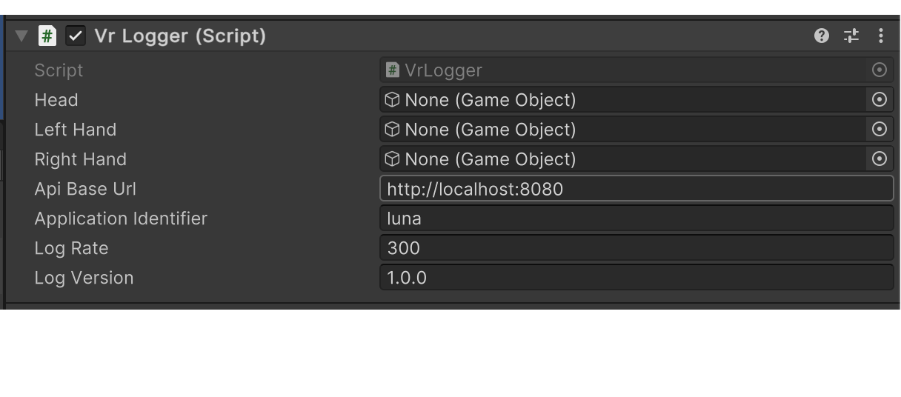

# VR Dashboard Logger
### 

This is the unity package that is used to communicate with the [VR Dashboard server](https://github.com/rehacekleos/vr_dashboard_be).<br>
The package supports getting the necessary information for logging VR data and for use in the WebGL module.

All available functionality can be found in the Changelogs file.

## Changelogs
Changelogs are specified in a separate file [CHANGELOG.md](https://github.com/rehacekleos/vr_dashboard_logger/blob/main/CHANGELOG.md)

## Usage

Add the Vr Logger script component in unity.<br>
In the script settings, define <b>Api Base Url, Application Identifier Log Version and a Game Objects</b> for what you want to track (head/left hand/right hand). <br>
Optional you can modify <b> Log Rate </b>. <br>
Create your own script where you implement the basic functionality.
#### Setting components in unity example:


#### Example of using Vr Logger in your own script (Example Usage):
```c++
 // Private field for VrLogger
private VrLogger vrLogger;

void Start()
{
    
    // Getting instance
     vrLogger = (VrLogger)VrLogger.Instance;
    
    // Set Organisation by Organisation code 
    vrLogger.SetOrganisation("KOyLfT");
    
    // Getting all Participant for application and organisation
    vrLogger.GetParticipants(list =>
    {
        // Check if list is null -> if yes, than request completed with error!
        if (list == null)
        {
            return;
        }
        var firstParticipant = list.ToArray()[0];
        
        // Set Participant for Activity
        vrLogger.SetParticipant(firstParticipant.id);
        
        // Initialize Logger -> Preparing for logging
        vrLogger.InitializeLogger();
        
        // Set custom data for activity
        vrLogger.SetCustomData("{\"custom\": 1}");
        
        // Start Logging with first environment
        vrLogger.StartLogging("first_level");
        
        // Record an event if happen
        vrLogger.SetEvent("collision");
        
        // Record custom data if happend
        vrLogger.SetRecordCustomData("{\"record_custom\": 1}");
        
        // Set new Environment -> follow records will have this environment
        vrLogger.SetEnvironment("second_level");
        
        // Stop logging
        vrLogger.StopLogging();
        
        // Send logged Activity to server, optional can set saving logs to local file
        vrLogger.SendActivity(response =>
        {
            Debug.Log(response);
        }, true);
    }); 
}
```

